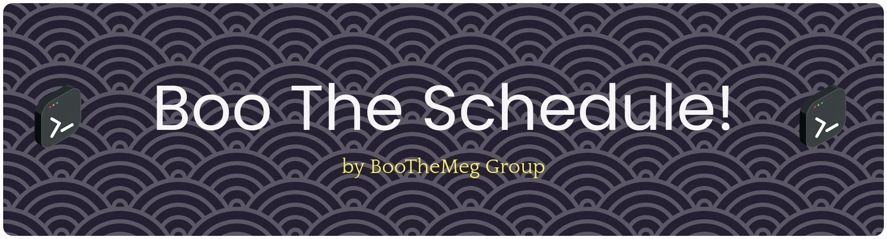

<h1 style="text-align: center;"> BooTheSchedule! </h1>



<p align="center">
    
    
    
    
    
</p>

<div align="center">
<h1 align="center" style="color: blue, font-size: 28px, margin: 10px 0;">BooTheSchedule!</h1>
<p align="center" style="font-size: 18px; margin: 10px 0;">Turn your notifications into calendar events automatically and intelligently. Heck, maybe even fast too.</p>
<p align="center" style="font-size: 10px; margin: 10px 0;">By BooTheMeg Group</p>
</div>

## Overview

BooTheSchedule is an end-to-end pipeline that captures notifications from your Android phone, runs them through an AI engine to detect scheduling intent, and adds the extracted events directly to your Google Calendar. No more manually typing "Team standup tomorrow at 10am" into your calendar. Your phone already told you about it! BooTheSchedule does the rest.

Built by BooTheMeg Group as a passion project to solve a problem we all felt: our phones buzz with plans, deadlines, and reminders all day, but none of that ever makes it into our actual calendars without manual effort.

## How does it work?

get_notif.py — Connects to an Android phone via ADB (Android Debug Bridge), dumps the notification tray using dumpsys notification, parses the raw output with regex to extract app names, senders, messages, and timestamps. Implements two-layer deduplication (ADB notification ID + content fingerprint) so the same notification is never processed twice.

processing.py — Takes the raw notification JSON and sends each message to OpenRouter AI (using the poolside/laguna-m.1 model) with a carefully crafted system prompt. The AI extracts structured calendar event data: title, date, time, duration, location, attendees, and recurrence rules. Output is validated against a strict schema before proceeding. Why laguna-m.1 you might ask? We dont have any clear reason other than because its free on openrouter.

calendar_api.py — Takes the validated event objects and inserts them into Google Calendar via the Google Calendar API (OAuth 2.0). Handles token refresh, timezone conversion, and builds proper Google Calendar event resources with optional fields like attendees and recurrence rules.

api.py (Flask REST API) — Wraps the entire pipeline into HTTP endpoints so the mobile app can trigger processing and calendar insertion over the network. Includes rate limiting, CORS support, and input validation.

Expo App (React Native) — A cross-platform mobile app (Android, iOS, web) with four tabs: Home (server status), Notifications (process with AI), Pipeline (end-to-end demo), and Settings (API configuration). Built with Expo Router, a Cal.com-inspired design system, and typed API client with timeout handling.

## Quickstart

Install uv dalam device

```bash
uv venv
# Follow instruction
uv add -r src/requirements.txt
uv sync
uv run python main.py
```


